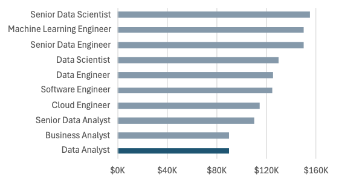

# Excel_Project_Data_Analytics


[Check out my work here](https://github.com/Delya1901/Excel_Project_Data_Analytics/blob/main/Excel%20Project%201%20Data%20Analytics.xlsx) 

  

## Introduction  

This data job salary dashboard was created to help job seekers investigate salaries for their desired jobs and ensure they are being adequately compensated.  

The data from course "Excel for Data Analytics" from Luke Barousse, which provides a foundation in analyzing data using this powerful tool. The data cantains detailed information on job titles, salaries, locations, and essential skills that are presented here.  

## Dashboard File  

My final dashboard is in here:  
[Check out my work here](https://github.com/Delya1901/Excel_Project_Data_Analytics/blob/main/Excel%20Project%201%20Data%20Analytics.xlsx)   

The following Excel skills were utilized for analysis:  

* Charts  
* Formulas and Functions  
* Data Validations  

## Data Jobs Dataset  

The dataset used for that project contains real-world data science job informaion from 2023. It includes detailed information on:  

* Job Titles  
* Salaries  
* Locations  
* Skills  

## Dashboar Build  

### Charts  

Data Science Job Salaries - Bar Chart  

  

* Excel Features: Utilized bar chart features (with formatted salary values) and optimized layout for clarity.  
* Design Choice: Horizontal bar chart for visual comparison of median salaries.  
* Data Organisation: Sorted job titles by descending salary for improved readibility.  
* Insights Gained: This enables quick identification of salary trends, noting that Senior roles and Engineers are higher-paying than Analyst roles.  

Country Median Salaries for Data Analyst   

 

* Excel Features: Utilized column chart features (with formatted salary values) and optimized layout for clarity.  
* Design Choice: Column chart for visual comparison of median salaries.  
* Data Representation: Plotted median salary for each country with available data.  
* Insights Gained: This enables quick grasp of global salary disparities and high/low salary regions.  

### Formulas and Functions  

#### Median Salary by Job Titles  

```Excel
=MEDIAN(
    IF(
        (jobs[job_title_short]=A4)*
        (jobs[salary_year_avg]<>0)*
        (jobs[job_country]=country)*
        (ISNUMBER(SEARCH(type,jobs[job_schedule_type]))),
        jobs[salary_year_avg]
)
)
```    

* **Multi-Criteria Filtering:** Checks job title, country,schedule type, and excludes blank salaries.  
* **Array Formula:** Utilizes MEDIAN() function with nested IF() statement to analyze an array.  
* **Tailored Insights:** Provides specific salary information for job titles, regions, and schedule type.  
* **Formula Purpose:** This formula populates the table below, returning the median salary based on job title, country and type of schedule specified.  

Backgraound Table  

  

Dashboard Implementation  


  

#### ⏰ Count of Job Schedule Type

```
=FILTER(J2#,(NOT(ISNUMBER(SEARCH("and",J2#))+ISNUMBER(SEARCH(",",J2#))))*(J2#<>0))
```

* **Unique List Generation:** This Excel formula below employs the `FILTER()` function to exclude entries containing "and" or commas, and omit zero values.
* **Formula Purpose:** This formula populates the table below, which gives us a list of unique job schedule types.  


🍽️ Background Table

  

Dashboard Implementation:  


###  Data Validation

#### Filtered List

*  **Enhanced Data Validation:** Implementing the filtered list as a data validation rule under the `Job Title`, `Country`, and `Type` option in the Data tab ensures:
    * User input is restricted to predefined, validated schedule types
    *  Incorrect or inconsistent entries are prevented
    *  Overall usability of the dashboard is enhanced  


## Conclusion

I created this dashboard to showcase insights into salary trends across various data-related job titles. Utilizing data from my Excel course, this dashboard allows users to make informed decisions about their career paths. Exploring the functionalities to understand how location and job type influence salaries.   

